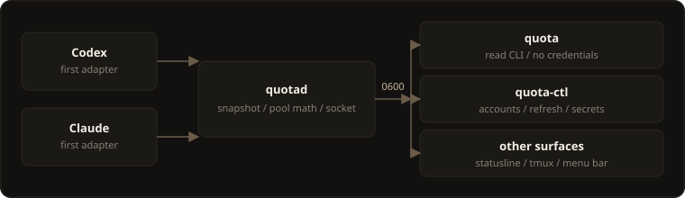
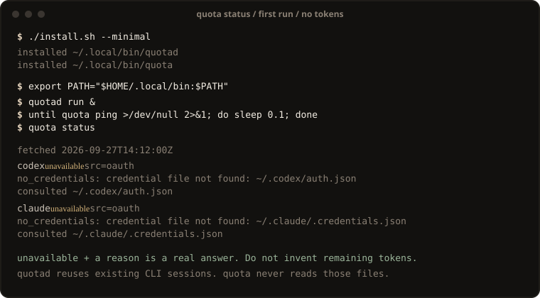

# infer-quota

[](https://github.com/op0ai/infer-quota/actions/workflows/ci.yml)
[](LICENSE)

Provider-agnostic inference quota daemon. Codex and Claude are the first adapters.

`quotad` polls enabled adapters, stores a snapshot, and owns a Unix socket.
`quota` is a thin read client. `quota-ctl` is the optional control plane.
A statusline, tmux segment, or menu bar should speak that socket.
[CodexBar](https://github.com/steipete/CodexBar) is a separate menu-bar
product; this repo is the small Rust core.

<p align="center">
  
</p>

## Quick start

Rust **1.83+**. macOS or Linux (Unix domain socket).

```bash
./install.sh                 # ~/.local/bin/{quotad,quota,quota-ctl}
# ./install.sh --minimal     # quotad + quota only (drops leftover quota-ctl)
export PATH="$HOME/.local/bin:$PATH"

quotad run &
until quota ping >/dev/null 2>&1; do sleep 0.1; done
quota status
```

`status: unavailable` plus a reason is a real answer. Do not invent remaining
tokens. `--from-release` uses a GitHub release tarball when one exists for
this triple; otherwise `install.sh` builds. Lean cargo (same as `--minimal`):
`cargo build --release -p quotad -p quota`.

<p align="center">
  
</p>

### Socket

`--socket` is on `quotad`, `quota`, and `quota-ctl`. `--config` is on
`quotad` only. Clients do not take `--config`; they read the default file.

1. `--socket`
2. `socket` in the config `quotad` loaded (`--config PATH`, else the default
   file). `quota` / `quota-ctl` read only the default file:
   `$XDG_CONFIG_HOME/quota/config.json`, else `~/.config/quota/config.json`
3. `QUOTA_SOCKET` when set and non-empty
4. `$XDG_RUNTIME_DIR/quota/quota.sock` when `XDG_RUNTIME_DIR` is set and non-empty
5. `~/.local/share/quota/quota.sock`

That order is `Config::socket_path` plus the CLI `--socket` override. Prefer
`$XDG_RUNTIME_DIR` over `/tmp`. Directory we create is `0700`; socket is
`0600`. Example: [docs/config.example.json](docs/config.example.json).

## Point an agent at it

[docs/AGENT.md](docs/AGENT.md) is the two-minute playbook. `quotad` is the
only process that may read existing CLI sessions. Never scrape:

| leave it alone | why |
|----------------|-----|
| `~/.codex/auth.json` | access + refresh tokens |
| `~/.claude/.credentials.json` | OAuth block |
| `cursor-session.json` | WorkOS JWT |
| browser cookie DBs | refused — we will not load a cookie store |

Read `quota status --json`, `pace`, and `can-start`. Do not invent extra
providers; v0 adapters are Codex and Claude.

## Security

Same-UID Unix socket, created `0600` in a directory we make `0700`. `quota`
never reads credentials and never talks HTTPS. Secrets stay in `quota-ctl`
(`secret put` is `--from-env` only; `secret get` prints `present=true`, not
bytes). `quotad` reuses existing CLI session files in RAM for one probe and
does not write them. Threat model: [docs/SECURITY.md](docs/SECURITY.md).

## Performance

Measured on one VM after the #5 Pareto pass. Not SLOs. Not provider latency.
Idle `quotad` was **3252 kB** VmRSS / **1** thread; socket `status` mean
**21.2 µs** (n=1000). Full tables: [docs/BENCHMARKS.md](docs/BENCHMARKS.md).

## Commands

| command | purpose |
|---------|---------|
| `quota status [--json] [--provider …]` | latest snapshot |
| `quota pace` / `quota can-start --tokens N` | burn rate, ETA, fit |
| `quota watch` / `quota ping` | stream after refresh; liveness |
| `quota-ctl accounts …` / `refresh` | metadata + probe now |
| `quota-ctl secret …` | local secrets chain |

Protocol: 4-byte little-endian length + compact JSON, max 256 KiB.
[docs/protocol.md](docs/protocol.md).

## Docs

| doc | what |
|-----|------|
| [docs/AGENT.md](docs/AGENT.md) | install, socket env, what never to scrape |
| [docs/BENCHMARKS.md](docs/BENCHMARKS.md) | verified sizes, RTT, RSS |
| [docs/SECURITY.md](docs/SECURITY.md) · [docs/SECRETS.md](docs/SECRETS.md) | trust model and secrets chain |
| [docs/SOURCES.md](docs/SOURCES.md) | probe hypotheses (several undocumented) |

Engineering notes live in [`docs/`](docs/). AGENT.md stays the deep agent
playbook. No public custom-domain docs URL is attached yet.

GitHub: <https://github.com/op0ai/infer-quota> ·
Origin: <https://origin.cursor.com/op0/infer-quota>

## License

MIT — see [LICENSE](LICENSE).
